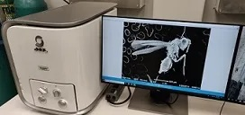

.. include:: ../substitutions.txt

.. _aps_13_sem:

APS Sector 13 Bench-top SEM
===============================================================

Facility Overview
~~~~~~~~~~~~~~~~~~~~~~~

GSECARS Bench-top SEM is a JEOL JCM-6000Plus with EDS.

    JEOL JCM-6000Plus in the APS Sector 13 chemistry lab.

To use this, please:

 1. Submit an ESAF for use of the SEM or, if you have beam time
    scheduled at GSECARS, make sure you note use of the SEM in your
    experiment ESAF. All materials intended to be examined must be
    listed and pre-approved.

 2. Check with beamline staff to make sure the date for use is
    available and to have the time reserved on the SEM schedule. All
    use must be scheduled.

 3. Prior to use, all operators MUST be trained by beamline staff on
    use of the instrument, must have read the available Standard
    Operating Procedure (SOP) for the instrument and certify they
    understand the SOP and agree to fully comply with the stated
    procedures.

Documents:

  *   :download:`JEOL 6000Plus Manual <../_images/APS/JEOL6000Plus_catalog_en.pdf>`
  *   :download:`Standard Operating Procedure <../_images/APS/JEOL6000Plus_SEM_SOP_2019.pdf>`

Contacts
~~~~~~~~~~~~~~

 +-----------------------+-----------------------------------+
 | Name                  | email                             |
 +=======================+===================================+
 | Tony Lanzirotti       | lanzirotti@uchicago.edu           |
 +-----------------------+-----------------------------------+

Specifications
~~~~~~~~~~~~~~~~~~~~~~~~~~~~~

 +---------------------------+-----------------------------------------------------------+
 | Quantity                  | Value                                                     |
 +===========================+===========================================================+
 | Electron Source           |                                                           |
 +---------------------------+-----------------------------------------------------------+

Supported Techniques
~~~~~~~~~~~~~~~~~~~~~~~~

 * Back-scatter electron imaging
 * Energy-Dispersive Spectroscopy (EDS) detector for X-ray fluorescence
   analysis and imaging.

Detectors
~~~~~~~~~~~~~~~~~~~~

Additional Equipment
~~~~~~~~~~~~~~~~~~~~~~~~

 * Carbon-coating system

Data Collection Software
~~~~~~~~~~~~~~~~~~~~~~~~~~~

JEOL built-in software.

Data Visualization and Analysis Software
~~~~~~~~~~~~~~~~~~~~~~~~~~~~~~~~~~~~~~~~~~~~~~

JEOL built-in software.

Sample Mounting and Environments
~~~~~~~~~~~~~~~~~~~~~~~~~~~~~~~~~~~~~~

Standard SEM mounts

Related Support Laboratories
~~~~~~~~~~~~~~~~~~~~~~~~~~~~~~~~~~~

  * :ref:`aps_13ide_xrm`.
